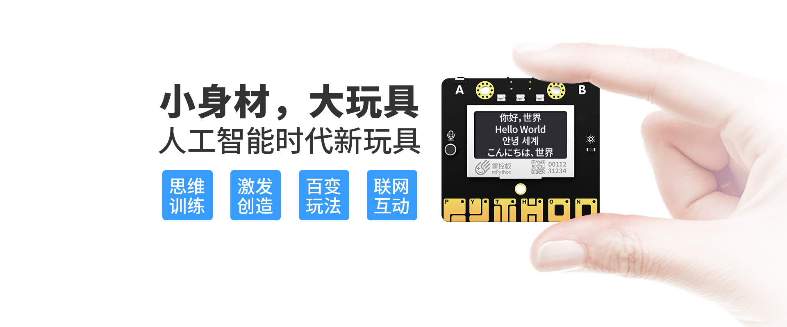
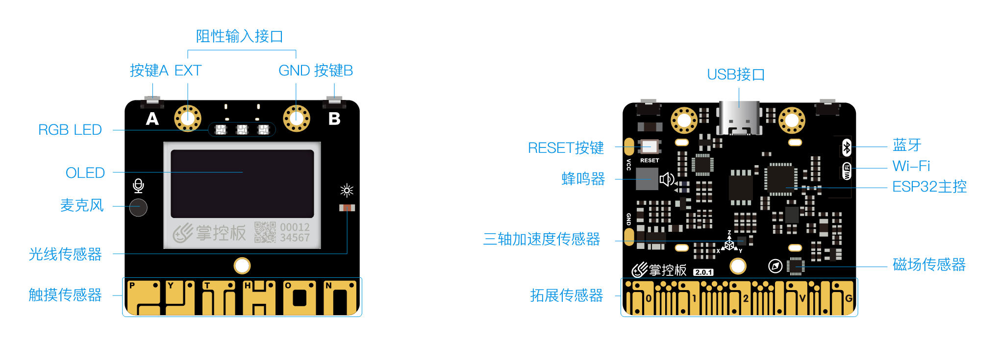
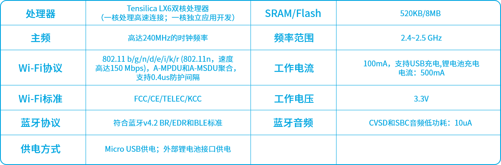

## 掌控板简介

采用物联网芯片ESP32，整合了常见的输入输出模块，支持Wi-Fi和蓝牙，是专为青少年编程教育而设计的一款开源硬件。

## 掌控板购买地址

1.盛思

[https://www.labplus.cn/handPy](https://www.labplus.cn/handPy)

2.DF商城

[https://www.dfrobot.com.cn](https://www.dfrobot.com.cn/category-367.html)